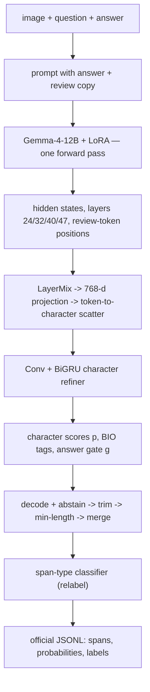

# System Description — SHROOM-visions 2026 submission `gemma4-lora-char-span-decoder(-refine)`

Character-level hallucination-span detection in image-conditioned VLM answers, four
language tracks (en / fr / it / zh). One submission file per language; every design
decision was validated with the organizers' official scorer on image-disjoint
development splits.

## 1. Overview and key idea

The system reads (image, question, answer) with a **LoRA-adapted Gemma-4-12B-it**
backbone. The **locator** produces character-level hallucination scores and BIO
boundary tags, plus an answer-level abstention score; a **separate classifier** then
assigns one of the five hallucination types to each decoded span. The system never
generates text: the backbone runs one forward pass and a small trained decoder reads
its intermediate hidden states.

**Why the answer appears twice in the prompt.** Gemma is a causal decoder: hidden
states extracted from a single copy of the answer could not see the rest of that
answer. The prompt therefore contains the answer twice:

```
Question: {question}
Candidate answer: {answer}
Review token by token:
{answer}
```

The first copy provides the complete candidate as context; features are extracted at
the tokens of the second ("review") copy, where every position can attend to the
image, the question, and the *entire* first copy — approximating bidirectional answer
context without touching the causal attention mask.



Per-language checkpoints:

| track | training data (post-filter) | schedule | best epoch |
|---|---|---|---|
| en | en only, 3,440 items | 5 epochs | 4 |
| fr | fr only, 3,410 | 3 epochs | 3 |
| it | it only, 3,417 | 3 epochs | 3 |
| zh | all four languages, 12,874 | 3 epochs | 2 |

The multilingual model is used **only for zh**, where it beat the zh-only model on
all three dev metrics (+0.032 IoU / +0.042 Cor / +0.028 Cor_lbl); zh has by far the
fewest hallucinated training answers (2,407) and benefited most from 4x data. For
en/fr/it the multilingual model showed no reliable gain and the dedicated models
were kept.

## 2. Data and splits

Official SHROOM-visions 2026 training data only; no external or synthetic data.

| track | items | unique images | clean / dirty | gold spans | hash-dev items | test items |
|---|---:|---:|---|---:|---:|---:|
| en | 3,799 | 1,607 | 962 / 2,837 | 12,894 | 359 | 1,201 |
| fr | 3,767 | 1,703 | 964 / 2,803 | 12,216 | 357 | 1,233 |
| it | 3,746 | 1,582 | 986 / 2,760 | 9,359 | 329 | 1,254 |
| zh | 3,790 | 1,647 | 1,383 / 2,407 | 7,529 | 352 | 1,210 |

**Split rule** (identical everywhere): an item goes to dev iff
`int(md5("13:" + image_name)[:8], 16) / 2^32 < 0.1` — all answers about one image
land on the same side, deterministically and independently of file composition. For
en, the dev side is further frozen into **tune-202** (all tuning decisions) and
**held-out-157** (evaluated exactly once, at the end). fr/it/zh use their full
hash-dev as the tuning split; they have no separate held-out (see Limitations).

**Cross-language leakage control**: the four tracks share images (121 of the 142
en-eval images also occur in the fr training set; 108 in it, 106 in zh). For
multilingual training, a hard filter drops every item of any language that shares an
image with a protocol eval item — 829 items removed (15,102 → 12,874 after also
removing eval/held-out items). Because the split hashes the image name, translated
siblings of eval items land on the dev side in every language, so single-language
training is safe by construction; the filter is a defense-in-depth for concatenated
files. Sampling for the multilingual model is proportional to data (concatenation +
shuffle), not balanced per language.

## 3. Backbone and LoRA

- **google/gemma-4-12B-it** (transformers 5.14.1 weights, unified decoder-only
  architecture, no separate vision encoder; 48 layers, hidden 3840; image budget 280
  soft tokens at 48-px patches). bf16, frozen.
- Images resized so max side = 768 px (the processor's token cap binds anyway).
- **LoRA**: rank 16, alpha 32 (scale α/r = 2), dropout 0.05, applied to the q/k/v/o
  attention projections of layers 24–47. That is 92 modules, not 96: Gemma-4 sets
  `attention_k_eq_v`, so the four full-attention layers in this range (29/35/41/47)
  have no v_proj. A initialized Kaiming-uniform, B zeros (identity at start);
  adapters kept in fp32 with cast-in/out (bf16 AdamW moments lose precision).
  10.7 M trainable adapter parameters.
- The layer range covers **all four feature-tap layers**; adapting only the top 8
  layers would leave the taps at 24 and 32 frozen by construction.

## 4. Locator decoder (~14.6 M parameters)

Feature extraction: hidden states `H ∈ R^{T x 4 x 3840}` from `hidden_states[l+1]`
for l ∈ {24, 32, 40, 47} (i.e., the output of each of those blocks; 0 is the
embedding layer), at the review-copy token positions.

1. **LayerMix**: four global scalars, softmax-normalized — one weight per tapped
   layer (initialized uniform);
2. Linear 3840 → 768;
3. **token→character scatter**: every character receives its covering token's
   768-d vector, concatenated with a 32-d embedding of the character's position
   *inside* its token (position index clamped to 0–63; embedding table 64 x 32);
4. **char refiner**: Conv1d(800→768, k=5, pad=2) + GELU, Conv1d(768→768, k=5,
   pad=2) + GELU;
5. **BiGRU**(768 → 2x384) added residually to the conv output;
6. heads on the refined 768-d character states: `z_p` (per-character logit — the
   submission probability), `z_q` (auxiliary localization logit), `z_bio`
   (3-way O/B/I), and `z_g` (answer gate, a linear head on the mean over valid
   character positions of the refined states); `p = σ(z_p)`, `g = σ(z_g)`.

| output | supervision | role at inference |
|---|---|---|
| `p` | soft annotator target, BCE + ranking | character probabilities; top-5% abstention signal; span probability (mean over span) |
| `q` | binary mask, Tversky | **training-only auxiliary** (not used at inference) |
| BIO | span boundaries, weighted CE | candidate span construction |
| `g` | answer-level clean/dirty | abstention |
| type head | — (no loss in final runs) | untrained; its outputs are discarded — all surviving span labels come from the external classifier |

An earlier jointly-trained type head repeatedly degraded localization, which is why
the final locator trains with no type loss and typing moved to a standalone
classifier (§6).

## 5. Training objective and optimization

Character targets `y_soft` use the official scorer's aggregation: probabilities of
*overlapping* annotator spans are **summed**, then clipped to [0,1]. `m = 1[y_soft>0]`
is the binary mask; BIO tags are derived from `m` (B at each run start, I inside).

```
L = 1.0 * BCEWithLogits(z_p, y_soft)                  # per-example mean over valid chars
  + 1.0 * Tversky(σ(z_q), m; α=0.7, β=0.3)            # TP/(TP + α·FN + β·FP), +1 smoothing
  + 0.5 * ranking(z_p)                                # pairwise hinge: hallucinated chars
                                                      #   above clean chars within an example;
                                                      #   contributes 0 on clean answers
  + 0.5 * CE(z_bio, tags; weights [O,B,I] = [1,4,2])
  + 0.2 * BCEWithLogits(z_g, y_answer)
  + 0.3 * MSE(σ(z_g), Top5Mean(σ(z_p)))               # gate consistency; gradients flow to
                                                      #   both sides (no detach)
```

Tversky with α > β penalizes false negatives harder — recall was the binding
constraint. The +1 smoothing makes the term well-behaved on clean answers (empty
gold mask). `Top5Mean` averages the k = max(3, ⌊n_chars/20⌋) largest character
probabilities.

Optimization: live backbone forward per item, batch 1 with gradient accumulation 16;
AdamW (PyTorch defaults: β=(0.9, 0.999), ε=1e-8, weight decay 0.01), lr 3e-4 for the
decoder / 1e-4 for LoRA, constant (no scheduler), grad-norm clip 1.0; epoch 1 is a
decoder-only warm-up with LoRA frozen; no gradient checkpointing, no image
augmentation; answers capped at 4,000 characters (no training answer exceeds it);
seed 13 (single seed — see Limitations); best checkpoint by dev IoU. One epoch over
3.4k items ≈ 12–15 min on one H100-80GB (~26 GB peak VRAM); the 12.9k multilingual
epoch ≈ 48 min. Software: torch 2.13.0+cu130, transformers 5.14.1.

## 6. Span-type classifier (the "-refine" step)

Trained per track on the **gold** spans of its training split (protocol eval items
excluded). Features per span: the layer-averaged frozen hidden state, meaned over
the span's tokens (3,840) + three scalars: span_length/50, start/answer_length,
end/answer_length. Model: LayerNorm → Linear(3843, 256) → GELU → Dropout(0.2) →
Linear(256, 5); class-balanced CE (invention + mischaracterization are 75–84% of
spans); AdamW 1e-3, 12 epochs.

For en: 11,489 training spans; validation = a random 10% **span-level** split
(~1,149 spans; not image-disjoint — see Limitations); best-epoch **balanced
accuracy 0.739** (macro-averaged per-class recall; chance = 0.20). Other tracks:
0.70–0.74.

The classifier is trained on gold boundaries but applied to imperfect predicted
spans. The end-to-end effect was therefore measured directly on predicted dev spans
with the official scorer: relabeling raised **Cor_lbl 0.2247 → 0.3348** on en
(fr 0.3534, it 0.3595, zh 0.4180), which is the deployment-condition evidence that
the gold→predicted distribution shift does not erase the gain.

## 7. Decoding and post-processing (exact order)

```
BIO argmax over characters
→ contiguous B/I runs become candidate spans (an I following O opens a span)
→ answer-level abstention: emit NO spans if g < g_thr, or if Top5Mean(p) < τ
→ trim edge whitespace/punctuation from each span
→ drop spans shorter than 3 characters
→ merge spans separated by ≤ 2 characters (keyed on the raw span labels)
→ span probability = mean p over the span (computed before trimming; unchanged after)
→ relabel every span with the type classifier
→ serialize
```

(τ, g_thr) per track, selected by official-scorer sweep on that track's dev:

| track | τ | g_thr |
|---|---:|---:|
| en | 0.0 | 0.5 |
| fr | 0.4 | 0.0 |
| it | 0.25 | 0.6 |
| zh | 0.0 | 0.7 |

The trim/min-length/merge setting was swept on en dev and shared across tracks
(fr/it dev sweeps agreed; the min-length-3 rule was not separately ablated for zh —
see Limitations). Measured-neutral and therefore *not* applied: snapping span edges
to word boundaries. Raw output crosses word boundaries ~10x more often than gold
(34–44% of edges vs 4%), but character-IoU turned out indifferent: expansion adds as
many wrong characters as it repairs (dev: 0.4225 no-snap vs 0.4218 either direction).

**Worked example** (illustrative, not a corpus item; offsets are half-open
`[start, end)` over Python Unicode code points):

```
Question:  What is shown in the image?        (image: a blue car, no tree)
Answer:    The car is red and parked beside a tree.
BIO spans:            [11,14)          [26,39)
g = 0.83 ≥ g_thr = 0.5;  Top5Mean(p) = 0.76 ≥ τ  → keep spans
output: [{"start": 11, "end": 14, "prob": 0.91, "label": "mischaracterization"},
         {"start": 26, "end": 39, "prob": 0.78, "label": "invention"}]
```

**Clean-answer example** (why abstention combines two signals): an answer may
trigger the gate (`g = 0.71`) while the character evidence stays flat
(`Top5Mean(p) = 0.19 < τ`); the two-signal rule then declares it clean. Either
signal falling below its threshold abstains.

## 8. Token↔character alignment

"Character" = Python Unicode code point; all offsets are half-open `[start, end)`.
Review-copy token positions are located by searching the prompt's token ids for the
tokenization of `"\n" + answer` (last occurrence = the review copy); character
offsets come from the fast tokenizer's **offset mapping**, never from decode-and-
search. Two bugs made this subtle and are regression-tested: (a) chat templates
rstrip message content, so answers with trailing newlines (54/3,799 in en) never
matched until the target string was canonicalized the same way; (b) reconstructing
offsets by decoding tokens and `str.find` silently corrupts non-ASCII text — a
byte-fallback token that splits a multi-byte character never matches, and the error
compounds to the end of the answer (32 fr/it/zh items, offsets up to 1.7x past the
text length). Alignment was verified exact on all ~20k items of all 8 data files.
A token covering several characters gives each of them the same token vector; the
in-token position embedding (index of the character within its token, clamped at
63) lets the char refiner disambiguate.

## 9. Metrics and evaluation protocol

Official scorer semantics (vendored from the participant kit): per item, **IoU** is
the intersection-over-union of predicted vs gold *character index sets* (an empty
prediction on a clean answer scores 1.0 — hence the "predict-nothing floor" equals
the clean share of the split); **Cor** is the Spearman correlation of the predicted
vs gold per-character probability vectors (gold sums overlapping annotator spans;
constant vectors fall back to a 0/1 agreement rule); **Cor_lbl** averages Cor over
the label-filtered vectors for each hallucination type present in either side.
Scores are averaged over items. Uncertainty: 95% percentile CIs from bootstrap
resampling of **image clusters** (all items of an image resampled together);
"significant" = the CI of the paired delta vs the floor excludes zero.

en development flow: all decisions on tune-202; the finished pipeline was then run
**once** on held-out-157 (IoU 0.3850 [0.319–0.451], Cor 0.4267), confirming the
tune numbers transfer before submission.

## 10. Results

Test leaderboard, evaluation phase (v1 = constant-label post-processing; v2 =
"-refine", keep-label post-processing + classifier relabeling):

| track | Cor+Lbl v1 → v2 | Cor v1 → v2 |
|---|---|---|
| EN | 0.1993 → **0.3129** | 0.4477 → **0.4491** |
| FR | 0.2360 → **0.3181** | 0.4323 → **0.4378** |
| IT | 0.2480 → **0.3373** | 0.4892 → **0.4926** |
| ZH | 0.3072 → **0.3759** | 0.4833 → **0.4882** |

Test IoU was not displayed in the evaluation-phase table; dev IoU is reported below.
**Note on v1 vs v2 spans:** within v2, relabeling is exactly label-only — the
keep-label and relabeled files were verified programmatically to have byte-identical
spans and probabilities, so the classifier cannot move IoU/Cor. The *small* v1→v2
Cor changes have a different, known cause: the merge step is keyed on span labels,
so v1's constant-label pipeline merges slightly more aggressively than v2's
keep-label pipeline (en test: 2,179 vs 2,285 spans). This span-set difference was
dev-measured at ±0.0004 IoU / ±0.0002 Cor before shipping.

Dev, official scorer (floor = predict-nothing = clean share):

| track | floor | IoU | Cor | Cor_lbl |
|---|---:|---:|---:|---:|
| en (tune-202; held-out in parens) | 0.213 | 0.4221 (0.3850) | 0.4529 (0.4267) | 0.3348 |
| fr | 0.297 | 0.4513 | 0.4393 | 0.3534 |
| it | 0.289 | 0.4335 | 0.4696 | 0.3595 |
| zh — zh-only model, post-processed | 0.355 | 0.4703 | 0.4868 | 0.4180 |
| zh — multilingual model, trainer decode | 0.355 | **0.5121** | **0.5389** | 0.3639* |

\* before relabeling (different pipeline stage than the other rows). All IoU/Cor
deltas vs the floor are significant under the image-cluster bootstrap.

en progression during development (tune-202, official): predict-nothing 0.2129 →
starter baseline 0.2005 → zero-shot claim-gate hybrid 0.273 → frozen-feature decoder
≈0.37 → +LoRA 0.4151 → +post-processing 0.4225.

## 11. Findings that shaped the design (including negative results)

All statements below are single-seed observations under this setup (Gemma-4-12B,
these splits); wording is scoped accordingly.

1. **Decode heads saturate once features are good**: six families (threshold/
   hysteresis, relative-peak, BIO, DETR-style set prediction, segment-ranker + DP,
   semi-Markov CRF) landed within noise of each other on strong features. BIO kept
   for simplicity.
2. **Direct visual-token access did not help in any configuration tested**: a
   cross-attention branch over visual-token hidden states adds nothing — frozen
   (a zero-initialized ReZero gate never opened; shuffling images at eval changed
   predictions only at float-noise level) or LoRA-adapted (worse than without).
   Whatever the decoder uses arrives through the answer-token states. This does
   *not* by itself establish how much the final model relies on the image — the
   image-shuffle ablation of the final LoRA pipeline is future work (Limitations).
3. **Backbone adaptation was the largest single lever** (+0.039 IoU), isolated from
   continued-training confounds by a frozen-adapter control run through the
   identical live pipeline.
4. **Splitting clean/dirty objectives** (dirty-only locator + separate gate)
   reproduced LoRA's localization gain on frozen features but did not stack with it.
5. **All evaluated ensembles underperformed the best single model**: averaging
   character probabilities destroys the structured BIO+gate decode (−0.04), and
   span-level union/intersection/fill variants also lost (system correlation ≈0.73
   with a strictly weaker second model).
6. **More data paid off only where capacity adapts and data is scarce**: 4x
   multilingual data moved frozen-feature training by ≈0 and en/fr/it LoRA within
   run-to-run variation, but gave zh (fewest dirty answers) +0.03/+0.04.
7. **Type information was present in the frozen features all along** (balanced
   accuracy 0.74); joint training, not the representation, kept type heads dead.
8. **Quantization showed no measurable degradation for feature extraction** in this
   setup (nf4 ≈ int8 ≈ bf16, paired comparison).

## 12. Limitations

- Single seed (13) throughout; run-to-run variation was estimated only for one
  configuration (±0.006 IoU over three seeds of the frozen baseline).
- tune-202 was reused across many decisions (threshold sweeps, post-processing,
  model selection); the single-shot held-out mitigates this for en only — fr/it/zh
  have no untouched held-out.
- The type classifier trains on gold spans but runs on predicted spans; the
  end-to-end dev gain (§6) shows the shift is survivable, but per-class F1 /
  confusion structure under deployment conditions was not analyzed.
- Its validation split is span-random, not image-disjoint.
- The min-span-length-3 rule was tuned on en and applied to zh unmodified, although
  one or two CJK characters can carry a complete factual error.
- No image-shuffle / no-image ablation of the **final** LoRA pipeline was run; the
  system's causal dependence on the image is established only indirectly (zero-shot
  gate study: correct 0.694 / shuffled 0.629 / no-image 0.566 ROC-AUC).
- Results may be specific to the Gemma-4 family; one alternative backbone
  (Gemma-4-26B-A4B MoE) was screened (frozen: +0.015 over 12B; LoRA: below the 12B
  LoRA), no dense larger model was tried.
- Anonymity note: the public code repository and leaderboard identifier are
  trivially linkable; check the venue's anonymity policy before citing one from the
  other.

## 13. Reproducibility

Code, experiment log (results/STATUS.md), per-run manifests, fixed seeds, vendored
official scorer + format checker, and submission SHA-256 hashes:
https://github.com/sckwokyboom/Vision-Hallucination-Detector. Only official task
data; no RAG; no text generation; the prompt is a fixed non-generative template.
